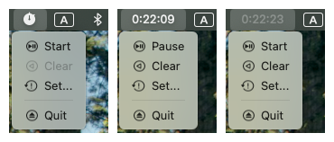
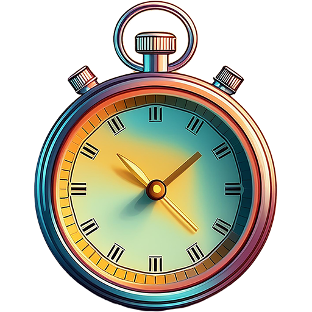

<h1>Timeroo</h2>

<!--  -->
<!--  -->
<!--  -->

A very simple MacOS status bar Timer app. Made in homage to (but using no code from) the defunct [Thyme](https://joaomoreno.github.io/thyme/).

Timeroo:
- Sits unobtrusively in the system menu.
- Can start, pause, clear, and reset. That's it.
- Is fully controllable through AppleScript, which means you can easily assign keyboard
  shortcuts to operate it.

